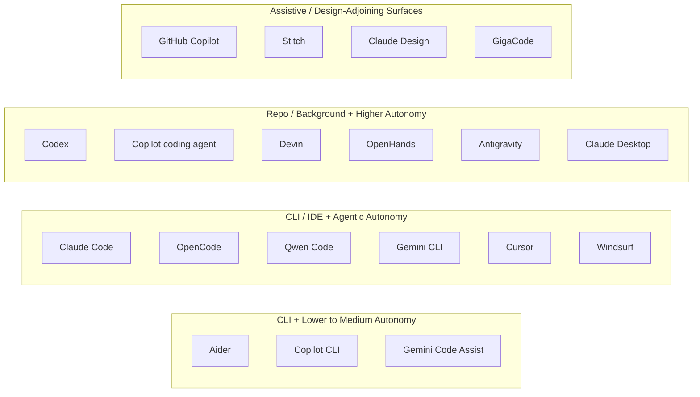

# AI-Assisted Software Development Tool Matrix - 2026

## English Abstract

This matrix places the main AI-Assisted Software Development tools on two axes: primary surface and agentic autonomy.

## Current Synthesis

The market has converged on a few recognizable shapes. Terminal agents such as [[english/tools/Claude Code|Claude Code]], [[english/tools/OpenCode|OpenCode]], [[english/tools/Qwen Code|Qwen Code]], and [[english/tools/Gemini CLI|Gemini CLI]] prioritize scriptability and repo-local control. IDE agents such as [[english/tools/Cursor|Cursor]], [[english/tools/Windsurf|Windsurf]], and [[english/tools/Gemini Code Assist|Gemini Code Assist]] optimize for reviewable editing and lower adoption friction. Repo and background agents such as [[english/tools/Codex|Codex]], [[english/tools/OpenHands|OpenHands]], [[english/tools/Devin|Devin]], and [[english/tools/GitHub Copilot Coding Agent|GitHub Copilot Coding Agent]] maximize delegation but demand stronger task slicing and supervision. Design-adjacent tools such as [[english/tools/Stitch|Stitch]] and [[english/tools/Claude Design|Claude Design]] increasingly feed the same pipeline by turning visual intent into machine-usable artifacts. For a different lens on the same ecosystem, see [[english/analyses/Coding Tools by Style and Maturity - 2026|Coding Tools by Style and Maturity - 2026]].

## Matrix

## Comparison Table

| Tool | Primary surface | Agentic autonomy | Short note |
| --- | --- | --- | --- |
| [GitHub Copilot](<../tools/GitHub Copilot.md>) | IDE | Assistive | The iconic inline-completion tool. |
| [Aider](<../tools/Aider.md>) | CLI / terminal | Assistive to semi-agentic | Strong pair-programming and git ergonomics. |
| [Gemini Code Assist](<../tools/Gemini Code Assist.md>) | IDE | Assistive to semi-agentic | IDE coding assistant with citations and agent-mode trajectory. |
| [GigaCode](<../tools/GigaCode.md>) | IDE | Assistive to semi-agentic | Mixes inline completion with IDE chat and short commands. |
| [Claude Code](<../tools/Claude Code.md>) | CLI / terminal | Agentic | Terminal-first coding agent with verification, MCP, and skills. |
| [Gemini CLI](<../tools/Gemini CLI.md>) | CLI / terminal | Agentic | General local terminal agent for coding and adjacent tasks. |
| [GitHub Copilot CLI](<../tools/GitHub Copilot CLI.md>) | CLI / terminal | Agentic | Terminal-native GitHub assistant. |
| [OpenCode](<../tools/OpenCode.md>) | CLI / terminal | Agentic | Open terminal agent with repo-local control. |
| [Qwen Code](<../tools/Qwen Code.md>) | CLI / IDE bridge | Agentic | Open terminal agent with skills, subagents, and headless mode. |
| [Cursor](<../tools/Cursor.md>) | IDE | Agentic plus background | Strong editor workflow with agent modes and background agents. |
| [Windsurf](<../tools/Windsurf.md>) | IDE | Agentic | IDE-first environment with memories, rules, worktrees, and workflows. |
| [GitHub Copilot Coding Agent](<../tools/GitHub Copilot Coding Agent.md>) | Repo / cloud | High autonomy | Issue-to-PR background agent in GitHub surfaces. |
| [Codex](<../tools/Codex.md>) | App / repo / cloud | High autonomy | Parallel tasks, worktrees, skills, automations, and computer-use expansion. |
| [OpenHands](<../tools/OpenHands.md>) | Cloud / CLI / SDK | High autonomy | Open-source platform for delegated software development. |
| [Devin](<../tools/Devin.md>) | Cloud / background | High autonomy | Delegated software engineer framing for background work. |
| [Antigravity](<../tools/Antigravity.md>) | IDE / platform | High autonomy | Agent-first development platform across editor, terminal, and browser. |
| [Claude Desktop](<../tools/Claude Desktop.md>) | Desktop app | High autonomy | Visual desktop supervision with Cowork and local extensions. |
| [Stitch](<../tools/Stitch.md>) | Design canvas | Agentic design | Design agent for high-fidelity UI exploration and handoff. |
| [Claude Design](<../tools/Claude Design.md>) | Visual workspace | Agentic design | Prototypes and visual artifacts from prompts. |

## General-Use Agents Overlay

The coding matrix now overlaps with a parallel family of general-use agents. Tools like [[english/tools/OpenClaw|OpenClaw]], [[english/tools/Hermes Agent|Hermes Agent]], [[english/tools/OpenCrust|OpenCrust]], [[english/tools/Memoh|Memoh]], and [[english/tools/Goose|Goose]] are not pure coding tools, but they share the same harness primitives: persistent memory, skill systems, [[english/concepts/Model Context Protocol|MCP]] integrations, schedules, and sometimes multi-agent execution. See [[english/analyses/General Use Agents - 2026|General Use Agents - 2026]] and [[english/analyses/MCP vs Agent Skills|MCP vs Agent Skills]].

## Supporting Evidence

- [[english/sources/2026-cursor-agent-docs#Summary|Cursor agent docs]]
- [[english/sources/2026-windsurf-docs#Summary|Windsurf docs]]
- [[english/sources/2026-opencode-docs#Summary|OpenCode docs]]
- [[english/sources/2026-qwen-code-overview#Summary|Qwen Code overview]]
- [[english/sources/2026-aider-readme#Summary|Aider README]]
- [[english/sources/2026-openhands-intro#Summary|OpenHands introduction]]
- [[english/sources/2026-devin-intro#Summary|Introducing Devin]]
- [[english/sources/2026-anthropic-claude-design#Summary|Claude Design]]
- [[english/sources/2026-anthropic-claude-code-overview#Summary|Claude Code overview]]
- [[english/sources/2026-anthropic-claude-desktop#Summary|Install Claude Desktop]]
- [[english/sources/2026-google-gemini-code-assist-overview#Summary|Gemini Code Assist overview]]
- [[english/sources/2026-google-stitch-vibe-design#Summary|Stitch]]
- [[english/sources/2025-google-gemini-3-antigravity#Summary|Gemini 3 and Google Antigravity]]
- [[english/sources/2025-google-gemini-cli#Summary|Gemini CLI]]
- [[english/sources/2025-github-copilot-coding-agent-ga#Summary|Copilot coding agent GA]]
- [[english/sources/2026-github-copilot-cli-ga#Summary|GitHub Copilot CLI GA]]
- [[english/sources/2025-openai-introducing-codex#Summary|Introducing Codex]]
- [[english/sources/2026-openai-introducing-the-codex-app#Summary|Introducing the Codex app]]

## Related Pages

- [[english/index|Index]]
- [[english/themes/Tooling Landscape|Tooling Landscape]]
- [[english/theses|Theses]]
- [[english/analyses/Coding Tools by Style and Maturity - 2026|Coding Tools by Style and Maturity - 2026]]
- [[english/analyses/General Use Agents - 2026|General Use Agents - 2026]]
- [[english/analyses/MCP vs Agent Skills|MCP vs Agent Skills]]
