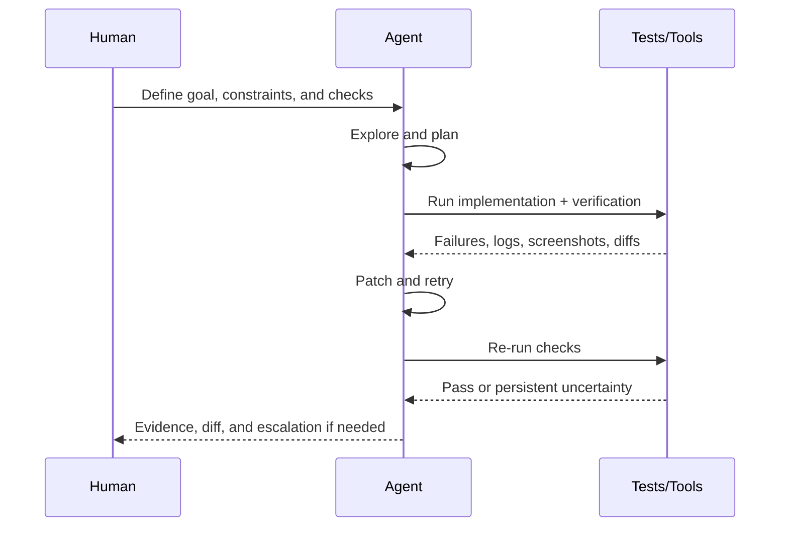

# Best Practices Playbook - AI-Assisted Software Development

## English Abstract

This note turns the current corpus into an operational playbook for AI-Assisted Software Development.

## Current Synthesis

The field has converged on four main components. First, make the problem legible: state goals, constraints, examples, quality bars, and explicit done conditions. Second, manage context deliberately: keep repo-local instruction files small and high-signal, store stable knowledge in markdown, and use subagents or worktrees instead of stuffing every search result into one transcript. Third, manage agents as workers with ownership, isolation, and review surfaces. Fourth, make verification the beating heart of the loop so that debugging can be automatic instead of purely conversational.

## Operating Rules

1. `Problem specification`
Write the request the way you would hand work to a strong but newly onboarded engineer. Include scope, non-goals, constraints, examples, and explicit verification. If the task is recurring, turn the prompt into a durable artifact such as AGENTS.md, DESIGN.md, or an idea file.

2. `Context management`
Keep default instructions concise. Put stable repo knowledge in repo files. Use references, design docs, or llms-style notes for detailed domain knowledge. Compact or summarize long sessions before they rot. Split broad exploration into subagents when needed.

3. `Agent management`
Assign clear ownership. Use worktrees or isolated environments for concurrent implementation. Prefer many bounded slices over one ambiguous mega-task. Keep review and merge as explicit human checkpoints even when autonomy is high.

4. `Automatic debugging loop`
Require the agent to implement, run, inspect failure, patch, and rerun. Good prompts attach the loop to tests, screenshots, builds, linters, or browser checks. The more objective the evaluator, the better the agent can self-correct.

5. `Design and intent artifacts`
Treat product specs, design notes, reliability rules, and knowledge bases as machine-readable control surfaces. Good AI-Assisted Software Development starts before code generation, at the layer where intent becomes structure.

6. `Non-coding extensions`
Reuse the same harness shape for deep research, note-taking, issue triage, release briefs, visual QA, spreadsheet work, and other technical operations whenever the work can be specified, tooled, and verified.

## Debugging Loop Diagram

## Supporting Evidence

- [[english/sources/2024-anthropic-building-effective-agents#Summary]]
- [[english/sources/2025-anthropic-claude-code-best-practices#Summary]]
- [[english/sources/2025-anthropic-effective-context-engineering#Summary]]
- [[english/sources/2026-openai-harness-engineering#Summary]]
- [[english/sources/2025-openai-introducing-codex#Summary]]
- [[english/sources/2025-google-gemini-cli#Summary]]
- [[english/sources/2026-metr-productivity-transcripts#Summary]]
- [[english/sources/2026-karpathy-idea-file-llm-wiki-snippet#Summary]]
- [[english/sources/2026-bcherny-worktrees-snippet#Summary]]

## Related Pages

- [[english/index]]
- [[english/theses]]
- [[english/themes/Verification, Testing, and Automatic Debugging]]
- [[english/themes/Context Management and Agent Memory]]
