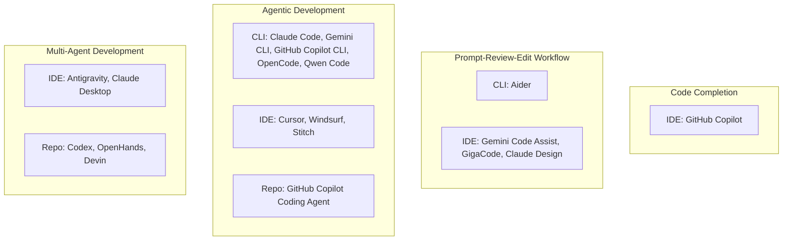

# Coding Tools by Style and Maturity - 2026

## English Abstract

This page classifies the major coding tools by their dominant operating surface and their dominant maturity stage in the historical evolution of AI-assisted software development.

## Current Synthesis

The two axes used here are intentionally different from the autonomy matrix in [[english/analyses/AI-Assisted Software Development Tool Matrix - 2026|AI-Assisted Software Development Tool Matrix - 2026]]. `Coding style` describes where supervision primarily happens: `CLI`, `IDE`, or `Repo`. `Maturity stage` describes which historical control loop the product most strongly represents: `Code Completion`, `Prompt-Review-Edit Workflow`, `Agentic Development`, or `Multi-Agent Development`, following the stage model in [[english/analyses/History of AI-Assisted Software Development|History of AI-Assisted Software Development]].

## Classification Diagram

## Reading Notes

- `CLI` means the terminal is the primary supervision and control surface.
- `IDE` includes editor-first and visual-workspace products, including design-adjacent tools when they materially shape implementation.
- `Repo` covers repo-native, background, app, or cloud products where issues, tasks, worktrees, branches, or PRs become the main supervision boundary.
- Some tools straddle stages. In those cases, the table below uses the dominant current product shape rather than every feature the tool happens to expose.

## Comparison Table

| Tool | Style | Maturity stage | Short note |
| --- | --- | --- | --- |
| [GitHub Copilot](<../tools/GitHub Copilot.md>) | IDE | Code Completion | The iconic inline-completion reference point. |
| [Aider](<../tools/Aider.md>) | CLI | Prompt-Review-Edit Workflow | Strong human-in-the-loop terminal pair programming. |
| [Gemini Code Assist](<../tools/Gemini Code Assist.md>) | IDE | Prompt-Review-Edit Workflow | IDE assistant with citations and a path into agent mode. |
| [GigaCode](<../tools/GigaCode.md>) | IDE | Prompt-Review-Edit Workflow | Combines inline completion with IDE chat and review commands. |
| [Claude Design](<../tools/Claude Design.md>) | IDE | Prompt-Review-Edit Workflow | Design-adjacent iterative artifact generation. |
| [Claude Code](<../tools/Claude Code.md>) | CLI | Agentic Development | Terminal-first coding agent with verification, MCP, and skills. |
| [Gemini CLI](<../tools/Gemini CLI.md>) | CLI | Agentic Development | Terminal agent spanning coding, research, and automation. |
| [GitHub Copilot CLI](<../tools/GitHub Copilot CLI.md>) | CLI | Agentic Development | GitHub-native terminal assistance beyond editor-only use. |
| [OpenCode](<../tools/OpenCode.md>) | CLI | Agentic Development | Open terminal agent centered on repo-local control. |
| [Qwen Code](<../tools/Qwen Code.md>) | CLI | Agentic Development | Open terminal agent with skills, subagents, and headless mode. |
| [Cursor](<../tools/Cursor.md>) | IDE | Agentic Development | IDE-native agent mode plus background work. |
| [Windsurf](<../tools/Windsurf.md>) | IDE | Agentic Development | IDE agent workflows with rules, memory, and worktrees. |
| [Stitch](<../tools/Stitch.md>) | IDE | Agentic Development | Design-canvas agent shaping implementation artifacts. |
| [GitHub Copilot Coding Agent](<../tools/GitHub Copilot Coding Agent.md>) | Repo | Agentic Development | Repo-native background implementation via GitHub surfaces. |
| [Antigravity](<../tools/Antigravity.md>) | IDE | Multi-Agent Development | Agent-first platform with manager-style orchestration. |
| [Claude Desktop](<../tools/Claude Desktop.md>) | IDE | Multi-Agent Development | Visual supervision surface with Cowork and local extensions. |
| [Codex](<../tools/Codex.md>) | Repo | Multi-Agent Development | Worktrees, projects, skills, automations, and delegated tasks. |
| [OpenHands](<../tools/OpenHands.md>) | Repo | Multi-Agent Development | Platformized, extensible delegated software-agent stack. |
| [Devin](<../tools/Devin.md>) | Repo | Multi-Agent Development | Delegated software engineer framing for background work. |

## Supporting Evidence

- [[english/sources/2021-github-introducing-github-copilot#Summary|Introducing GitHub Copilot]]
- [[english/sources/2026-gigacode-inline-code-assistant#Summary|GigaCode Inline Code Assistant]]
- [[english/sources/2026-gigacode-codechat#Summary|GigaCode CodeChat]]
- [[english/sources/2026-aider-readme#Summary|Aider README snapshot]]
- [[english/sources/2026-google-gemini-code-assist-overview#Summary|Gemini Code Assist overview]]
- [[english/sources/2026-anthropic-claude-code-overview#Summary|Claude Code overview]]
- [[english/sources/2025-google-gemini-cli#Summary|Gemini CLI]]
- [[english/sources/2026-github-copilot-cli-ga#Summary|GitHub Copilot CLI GA]]
- [[english/sources/2026-opencode-docs#Summary|OpenCode docs snapshot]]
- [[english/sources/2026-qwen-code-overview#Summary|Qwen Code overview]]
- [[english/sources/2026-cursor-agent-docs#Summary|Cursor agent docs]]
- [[english/sources/2026-windsurf-docs#Summary|Windsurf docs snapshot]]
- [[english/sources/2025-github-copilot-coding-agent-ga#Summary|Copilot coding agent GA]]
- [[english/sources/2025-google-gemini-3-antigravity#Summary|Gemini 3 and Google Antigravity]]
- [[english/sources/2025-openai-introducing-codex#Summary|Introducing Codex]]
- [[english/sources/2026-openai-introducing-the-codex-app#Summary|Introducing the Codex app]]
- [[english/sources/2026-openhands-intro#Summary|OpenHands introduction]]
- [[english/sources/2026-devin-intro#Summary|Introducing Devin]]

## Related Pages

- [[english/analyses/History of AI-Assisted Software Development|History of AI-Assisted Software Development]]
- [[english/analyses/AI-Assisted Software Development Tool Matrix - 2026|AI-Assisted Software Development Tool Matrix - 2026]]
- [[english/index|Index]]
