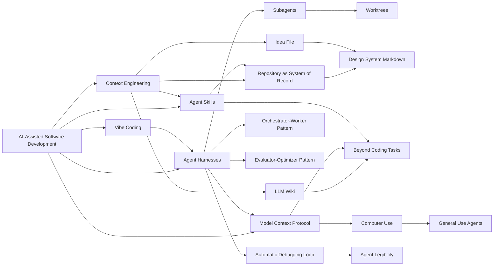

# Concept Graph - Agentic Coding

## English Abstract

This note makes the central AI-Assisted Software Development concept graph explicit instead of leaving the ideas as isolated pages.

## Current Synthesis

Three clusters dominate the current corpus. The first is repository intelligence: AGENTS.md, DESIGN.md, repo references, machine-readable intent, and on-demand procedural context through skills. The second is execution architecture: orchestrators, workers, subagents, worktrees, evaluator loops, and live external systems connected through MCP. The third is outward expansion: LLM wikis, idea files, computer use, general-use agents, and design systems that move the same harness pattern beyond source-code editing.

## Graph

## Supporting Evidence

- [[english/sources/2025-anthropic-effective-context-engineering#Summary]]
- [[english/sources/2026-openai-harness-engineering#Summary]]
- [[english/sources/2025-anthropic-claude-code-best-practices#Summary]]
- [[english/sources/2026-karpathy-llm-knowledge-bases-snippet#Summary]]
- [[english/sources/2026-karpathy-idea-file-llm-wiki-snippet#Summary]]

## Related Pages

- [[english/index]]
- [[english/theses]]
- [[english/themes/Context Management and Agent Memory]]
- [[english/themes/Agent Harnesses and Execution Loops]]
- [[english/concepts/Model Context Protocol]]
- [[english/concepts/Agent Skills]]
- [[english/concepts/Model Context Protocol]]
- [[english/concepts/Agent Skills]]
- [[english/concepts/Model Context Protocol]]
- [[english/concepts/Agent Skills]]
