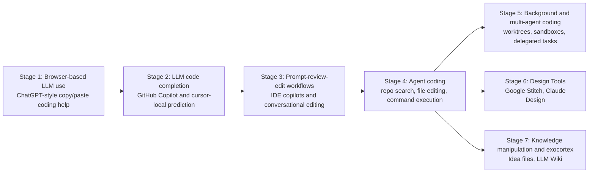

# History of AI-Assisted Software Development

## English Abstract

This note maps the main phase changes in AI-Assisted Software Development from browser chat and inline completion to agent coding, multi-agent software work, design-side agents, and knowledge-centric agent systems.

## Current Synthesis

The history of AI-Assisted Software Development is best understood as a sequence of expanding control loops. In release chronology, code completion arrived before browser chat. In adoption chronology, browser chat became the first mass on-ramp for many users. From there, the field moved through IDE-assisted editing, agentic tool use, and finally background orchestration across worktrees, apps, and knowledge systems.

## History of AI-Assisted Software Development

The stage breakdown below starts with browser use because that is where many users first encountered AI-assisted coding in practice, even though [[english/tools/GitHub Copilot|GitHub Copilot]] launched earlier on June 29, 2021 and ChatGPT arrived later on November 30, 2022.

## Timeline

## Stage Notes

- `Browser-based LLM use`: users pasted code into browser chat for explanation, debugging, translation, and one-off generation. See [[english/sources/2022-openai-introducing-chatgpt#Summary|Introducing ChatGPT]].
- `LLM code completion`: fast local suggestions reduced keystrokes but kept the human in control. Classic anchors are [[english/tools/GitHub Copilot|GitHub Copilot]] and the inline side of [[english/tools/GigaCode|GigaCode]]. See [[english/sources/2021-github-introducing-github-copilot#Summary|Introducing GitHub Copilot]] and [[english/sources/2026-gigacode-inline-code-assistant#Summary|GigaCode Inline Code Assistant]].
- `Prompt-review-edit workflows`: strong models inside IDEs shifted effort from typing syntax to stating intent and reviewing edits. Examples include [[english/tools/Cursor|Cursor]], [[english/tools/Gemini Code Assist|Gemini Code Assist]], and the CodeChat side of [[english/tools/GigaCode|GigaCode]]. See [[english/sources/2024-karpathy-cursor-sonnet-snippet#Summary|Karpathy on Cursor + Sonnet]], [[english/sources/2026-google-gemini-code-assist-overview#Summary|Gemini Code Assist overview]], and [[english/sources/2026-gigacode-codechat#Summary|GigaCode CodeChat]].
- `Agent coding`: agents gained repo search, file editing, command execution, and self-verification. This is where tools like [[english/tools/Claude Code|Claude Code]], [[english/tools/OpenCode|OpenCode]], [[english/tools/Qwen Code|Qwen Code]], and [[english/tools/Gemini CLI|Gemini CLI]] stop being mere suggesters and start operating a software loop. See [[english/sources/2025-openai-introducing-codex#Summary|Introducing Codex]], [[english/sources/2025-anthropic-claude-code-best-practices#Summary|Claude Code best practices]], and [[english/sources/2025-google-gemini-cli#Summary|Gemini CLI]].
- `Background and multi-agent coding`: worktrees, sandboxes, background environments, and PR review surfaces made delegation operational. Representative tools include [[english/tools/Codex|Codex]], [[english/tools/Antigravity|Antigravity]], [[english/tools/OpenHands|OpenHands]], [[english/tools/Devin|Devin]], and [[english/tools/GitHub Copilot Coding Agent|GitHub Copilot Coding Agent]]. See [[english/sources/2025-github-copilot-coding-agent-ga#Summary|Copilot coding agent GA]], [[english/sources/2026-openai-introducing-the-codex-app#Summary|Introducing the Codex app]], and [[english/sources/2026-bcherny-worktrees-snippet#Summary|Boris Cherny on worktrees]].
- `Design tools`: [[english/tools/Stitch|Stitch]] and [[english/tools/Claude Design|Claude Design]] widen the coding workflow by turning visual intent into machine-usable artifacts. See [[english/sources/2026-google-stitch-vibe-design#Summary|Stitch]] and [[english/sources/2026-anthropic-claude-design#Summary|Claude Design]].
- `Knowledge manipulation and exocortex`: [[english/concepts/Idea File|idea files]], [[english/concepts/LLM Wiki|LLM wikis]], and related knowledge structures extend the same harness ideas beyond source code. See [[english/sources/2025-karpathy-vibe-coding-snippet#Summary|Karpathy on vibe coding]], [[english/sources/2026-karpathy-idea-file-llm-wiki-snippet#Summary|Karpathy on the idea file and LLM Wiki]], and [[english/sources/2026-openai-codex-for-almost-everything#Summary|Codex for (almost) everything]].

## Related Pages

- [[english/index|Index]]
- [[english/theses|Theses]]
- [[english/themes/Agentic Coding and Vibe Coding|Agentic Coding and Vibe Coding]]
- [[english/themes/Labor, Roles, and Team Structure|Labor, Roles, and Team Structure]]
- [[english/analyses/Coding Tools by Style and Maturity - 2026|Coding Tools by Style and Maturity - 2026]]
