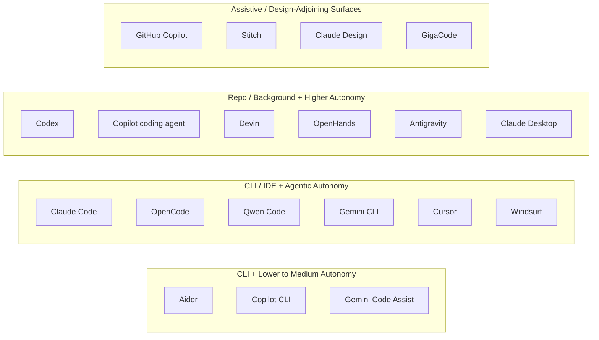

# AI-Assisted Software Development Tool Matrix - 2026

## Кратко

Эта матрица размещает главные инструменты AI-Assisted Software Development по двум осям: primary surface и agentic autonomy.

## Текущий синтез

Рынок сошелся в несколько узнаваемых форм. Terminal agents вроде [[russian/tools/Claude Code|Claude Code]], [[russian/tools/OpenCode|OpenCode]], [[russian/tools/Qwen Code|Qwen Code]] и [[russian/tools/Gemini CLI|Gemini CLI]] делают ставку на scriptability и repo-local control. IDE agents вроде [[russian/tools/Cursor|Cursor]], [[russian/tools/Windsurf|Windsurf]] и [[russian/tools/Gemini Code Assist|Gemini Code Assist]] оптимизируют reviewable editing и низкий порог внедрения. Repo и background agents вроде [[russian/tools/Codex|Codex]], [[russian/tools/OpenHands|OpenHands]], [[russian/tools/Devin|Devin]] и [[russian/tools/GitHub Copilot Coding Agent|GitHub Copilot Coding Agent]] максимизируют delegation, но требуют более сильного task slicing и supervision. Design-adjacent tools вроде [[russian/tools/Stitch|Stitch]] и [[russian/tools/Claude Design|Claude Design]] все чаще подпитывают тот же pipeline, превращая visual intent в machine-usable artifacts. Для другого взгляда на ту же экосистему см. [[russian/analyses/Coding Tools by Style and Maturity - 2026|Coding Tools by Style and Maturity - 2026]].

## Матрица

## Сравнительная таблица

| Инструмент | Primary surface | Agentic autonomy | Короткая заметка |
| --- | --- | --- | --- |
| [GitHub Copilot](<../tools/GitHub Copilot.md>) | IDE | Assistive | Иконический inline-completion tool. |
| [Aider](<../tools/Aider.md>) | CLI / terminal | Assistive to semi-agentic | Сильное pair-programming и git ergonomics. |
| [Gemini Code Assist](<../tools/Gemini Code Assist.md>) | IDE | Assistive to semi-agentic | IDE coding assistant с citations и движением к agent mode. |
| [GigaCode](<../tools/GigaCode.md>) | IDE | Assistive to semi-agentic | Совмещает inline completion с IDE chat и short commands. |
| [Claude Code](<../tools/Claude Code.md>) | CLI / terminal | Agentic | Terminal-first coding agent с verification, MCP и skills. |
| [Gemini CLI](<../tools/Gemini CLI.md>) | CLI / terminal | Agentic | General local terminal agent для coding и adjacent tasks. |
| [GitHub Copilot CLI](<../tools/GitHub Copilot CLI.md>) | CLI / terminal | Agentic | Terminal-native GitHub assistant. |
| [OpenCode](<../tools/OpenCode.md>) | CLI / terminal | Agentic | Open terminal agent с repo-local control. |
| [Qwen Code](<../tools/Qwen Code.md>) | CLI / IDE bridge | Agentic | Open terminal agent со skills, subagents и headless mode. |
| [Cursor](<../tools/Cursor.md>) | IDE | Agentic plus background | Сильный editor workflow с agent modes и background agents. |
| [Windsurf](<../tools/Windsurf.md>) | IDE | Agentic | IDE-first environment с memories, rules, worktrees и workflows. |
| [GitHub Copilot Coding Agent](<../tools/GitHub Copilot Coding Agent.md>) | Repo / cloud | High autonomy | Issue-to-PR background agent в GitHub surfaces. |
| [Codex](<../tools/Codex.md>) | App / repo / cloud | High autonomy | Parallel tasks, worktrees, skills, automations и computer-use expansion. |
| [OpenHands](<../tools/OpenHands.md>) | Cloud / CLI / SDK | High autonomy | Open-source platform для delegated software development. |
| [Devin](<../tools/Devin.md>) | Cloud / background | High autonomy | Framing delegated software engineer для background work. |
| [Antigravity](<../tools/Antigravity.md>) | IDE / platform | High autonomy | Agent-first development platform через editor, terminal и browser. |
| [Claude Desktop](<../tools/Claude Desktop.md>) | Desktop app | High autonomy | Visual desktop supervision с Cowork и local extensions. |
| [Stitch](<../tools/Stitch.md>) | Design canvas | Agentic design | Design agent для high-fidelity UI exploration и handoff. |
| [Claude Design](<../tools/Claude Design.md>) | Visual workspace | Agentic design | Прототипы и визуальные artifacts из prompts. |

## Overlay про general-use agents

Coding matrix теперь пересекается с параллельным семейством general-use agents. Инструменты вроде [[russian/tools/OpenClaw|OpenClaw]], [[russian/tools/Hermes Agent|Hermes Agent]], [[russian/tools/OpenCrust|OpenCrust]], [[russian/tools/Memoh|Memoh]] и [[russian/tools/Goose|Goose]] не являются чистыми coding tools, но используют те же harness primitives: persistent memory, skill systems, [[russian/concepts/Model Context Protocol|MCP]] integrations, schedules и иногда multi-agent execution. См. [[russian/analyses/General Use Agents - 2026|General Use Agents - 2026]] и [[russian/analyses/MCP vs Agent Skills|MCP vs Agent Skills]].

## Поддерживающие источники

- [[russian/sources/2026-cursor-agent-docs#Сводка|Cursor agent docs]]
- [[russian/sources/2026-windsurf-docs#Сводка|Windsurf docs]]
- [[russian/sources/2026-opencode-docs#Сводка|OpenCode docs]]
- [[russian/sources/2026-qwen-code-overview#Сводка|Qwen Code overview]]
- [[russian/sources/2026-aider-readme#Сводка|Aider README]]
- [[russian/sources/2026-openhands-intro#Сводка|OpenHands introduction]]
- [[russian/sources/2026-devin-intro#Сводка|Introducing Devin]]
- [[russian/sources/2026-anthropic-claude-design#Сводка|Claude Design]]
- [[russian/sources/2026-anthropic-claude-code-overview#Сводка|Claude Code overview]]
- [[russian/sources/2026-anthropic-claude-desktop#Сводка|Install Claude Desktop]]
- [[russian/sources/2026-google-gemini-code-assist-overview#Сводка|Gemini Code Assist overview]]
- [[russian/sources/2026-google-stitch-vibe-design#Сводка|Stitch]]
- [[russian/sources/2025-google-gemini-3-antigravity#Сводка|Gemini 3 and Google Antigravity]]
- [[russian/sources/2025-google-gemini-cli#Сводка|Gemini CLI]]
- [[russian/sources/2025-github-copilot-coding-agent-ga#Сводка|Copilot coding agent GA]]
- [[russian/sources/2026-github-copilot-cli-ga#Сводка|GitHub Copilot CLI GA]]
- [[russian/sources/2025-openai-introducing-codex#Сводка|Introducing Codex]]
- [[russian/sources/2026-openai-introducing-the-codex-app#Сводка|Introducing the Codex app]]

## Связанные страницы

- [[russian/index|Index]]
- [[russian/themes/Tooling Landscape|Tooling Landscape]]
- [[russian/theses|Theses]]
- [[russian/analyses/Coding Tools by Style and Maturity - 2026|Coding Tools by Style and Maturity - 2026]]
- [[russian/analyses/General Use Agents - 2026|General Use Agents - 2026]]
- [[russian/analyses/MCP vs Agent Skills|MCP vs Agent Skills]]
