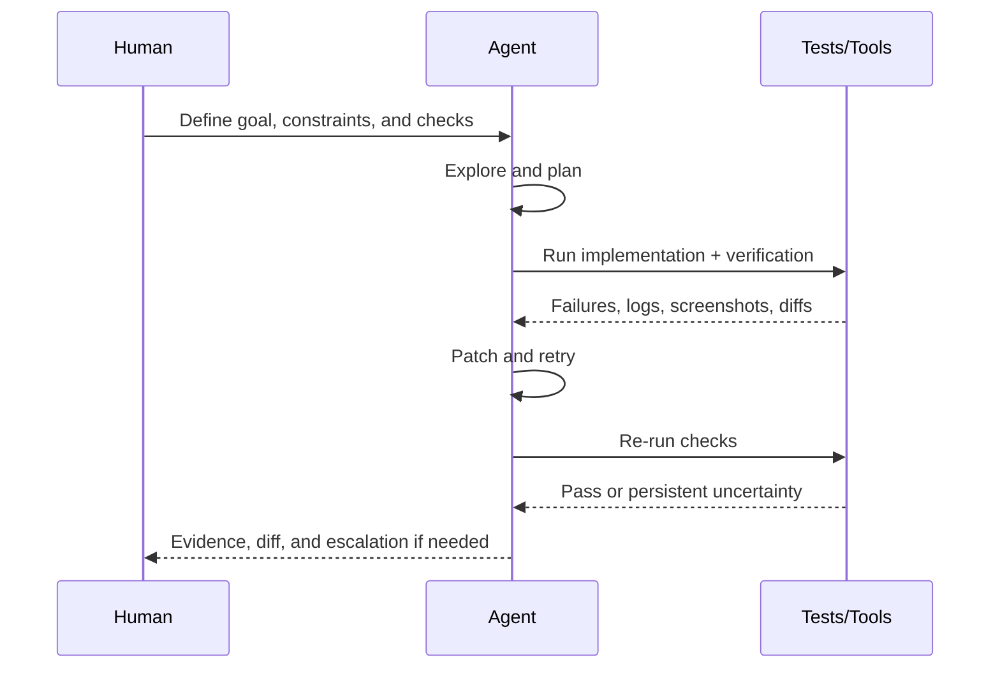

# Playbook лучших практик - AI-Assisted Software Development

## Кратко

Эта заметка превращает текущий корпус в операционный playbook для AI-Assisted Software Development.

## Текущий синтез

Поле сошлось к четырем главным компонентам. Во-первых, сделайте проблему legible: задайте goals, constraints, примеры, quality bars и явные done conditions. Во-вторых, сознательно управляйте контекстом: держите repo-local instruction files небольшими и high-signal, храните стабильное знание в markdown и используйте subagents или worktrees вместо того, чтобы запихивать весь search result в один transcript. В-третьих, управляйте агентами как workers с ownership, изоляцией и review surfaces. В-четвертых, сделайте verification сердцем цикла, чтобы debugging был автоматическим, а не только разговорным.

## Операционные правила

1. `Problem specification`
Пишите запрос так, как будто передаете работу сильному, но недавно онбордингованному инженеру. Укажите scope, non-goals, constraints, примеры и явную verification. Если задача повторяется, превращайте prompt в долговечный артефакт вроде AGENTS.md, DESIGN.md или idea file.

2. `Context management`
Держите default-инструкции короткими. Стабильное знание о репозитории помещайте в файлы репозитория. Для подробного domain knowledge используйте references, design docs или llms-style notes. Compact-ите или суммируйте длинные сессии до того, как они сгниют. Разделяйте широкое exploration на subagents, когда это нужно.

3. `Agent management`
Назначайте clear ownership. Используйте worktrees или изолированные среды для concurrent implementation. Предпочитайте много ограниченных slices вместо одной большой неоднозначной задачи. Держите review и merge явными human checkpoints даже при высокой автономии.

4. `Automatic debugging loop`
Требуйте от агента implement, run, inspect failure, patch и rerun. Хорошие prompts привязывают loop к тестам, screenshots, builds, linters или browser checks. Чем объективнее evaluator, тем лучше агент умеет self-correct.

5. `Design and intent artifacts`
Рассматривайте product specs, design notes, reliability rules и knowledge bases как machine-readable control surfaces. Хороший AI-Assisted Software Development начинается еще до генерации кода — на слое, где intent превращается в структуру.

6. `Non-coding extensions`
Переиспользуйте тот же shape harness для deep research, note-taking, issue triage, release briefs, visual QA, spreadsheet work и других technical operations всякий раз, когда работу можно специфицировать, дать ей tools и проверить.

## Диаграмма цикла отладки

## Поддерживающие источники

- [[russian/sources/2024-anthropic-building-effective-agents#Summary]]
- [[russian/sources/2025-anthropic-claude-code-best-practices#Summary]]
- [[russian/sources/2025-anthropic-effective-context-engineering#Summary]]
- [[russian/sources/2026-openai-harness-engineering#Summary]]
- [[russian/sources/2025-openai-introducing-codex#Summary]]
- [[russian/sources/2025-google-gemini-cli#Summary]]
- [[russian/sources/2026-metr-productivity-transcripts#Summary]]
- [[russian/sources/2026-karpathy-idea-file-llm-wiki-snippet#Summary]]
- [[russian/sources/2026-bcherny-worktrees-snippet#Summary]]

## Связанные страницы

- [[russian/index]]
- [[russian/theses]]
- [[russian/themes/Verification, Testing, and Automatic Debugging]]
- [[russian/themes/Context Management and Agent Memory]]
