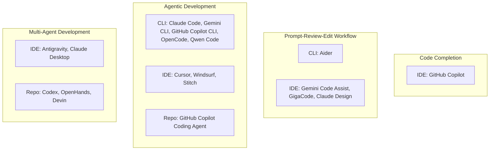

# Coding Tools by Style and Maturity - 2026

## Кратко

Эта страница классифицирует главные coding tools по их доминирующей operating surface и доминирующей стадии зрелости в исторической эволюции AI-assisted software development.

## Текущий синтез

Две оси здесь намеренно отличаются от autonomy-matrix в [[russian/analyses/AI-Assisted Software Development Tool Matrix - 2026|AI-Assisted Software Development Tool Matrix - 2026]]. `Coding style` описывает, где в основном происходит supervision: `CLI`, `IDE` или `Repo`. `Maturity stage` описывает, какой исторический control loop продукт представляет сильнее всего: `Code Completion`, `Prompt-Review-Edit Workflow`, `Agentic Development` или `Multi-Agent Development`, следуя stage-model из [[russian/analyses/History of AI-Assisted Software Development|History of AI-Assisted Software Development]].

## Диаграмма классификации

## Как читать карту

- `CLI` означает, что терминал является основной surface управления и supervision.
- `IDE` включает editor-first и visual-workspace products, в том числе design-adjacent tools, когда они materially shape implementation.
- `Repo` покрывает repo-native, background, app или cloud products, где issues, tasks, worktrees, branches или PRs становятся главной границей supervision.
- Некоторые инструменты лежат сразу на нескольких стадиях. В таких случаях таблица ниже использует доминирующую текущую product-shape, а не все функции сразу.

## Сравнительная таблица

| Инструмент | Style | Maturity stage | Короткая заметка |
| --- | --- | --- | --- |
| [GitHub Copilot](<../tools/GitHub Copilot.md>) | IDE | Code Completion | Иконическая точка отсчета для inline completion. |
| [Aider](<../tools/Aider.md>) | CLI | Prompt-Review-Edit Workflow | Сильное terminal pair-programming с human-in-the-loop. |
| [Gemini Code Assist](<../tools/Gemini Code Assist.md>) | IDE | Prompt-Review-Edit Workflow | IDE assistant с citations и путем в agent mode. |
| [GigaCode](<../tools/GigaCode.md>) | IDE | Prompt-Review-Edit Workflow | Совмещает inline completion с IDE chat и review-командами. |
| [Claude Design](<../tools/Claude Design.md>) | IDE | Prompt-Review-Edit Workflow | Design-adjacent итеративная генерация артефактов. |
| [Claude Code](<../tools/Claude Code.md>) | CLI | Agentic Development | Terminal-first coding agent с verification, MCP и skills. |
| [Gemini CLI](<../tools/Gemini CLI.md>) | CLI | Agentic Development | Terminal agent для coding, research и automation. |
| [GitHub Copilot CLI](<../tools/GitHub Copilot CLI.md>) | CLI | Agentic Development | GitHub-native terminal assistance за пределами editor-only use. |
| [OpenCode](<../tools/OpenCode.md>) | CLI | Agentic Development | Open terminal agent, центрированный на repo-local control. |
| [Qwen Code](<../tools/Qwen Code.md>) | CLI | Agentic Development | Open terminal agent со skills, subagents и headless mode. |
| [Cursor](<../tools/Cursor.md>) | IDE | Agentic Development | IDE-native agent mode плюс background work. |
| [Windsurf](<../tools/Windsurf.md>) | IDE | Agentic Development | IDE agent workflows с rules, memory и worktrees. |
| [Stitch](<../tools/Stitch.md>) | IDE | Agentic Development | Design-canvas agent, формирующий implementation artifacts. |
| [GitHub Copilot Coding Agent](<../tools/GitHub Copilot Coding Agent.md>) | Repo | Agentic Development | Repo-native background implementation через GitHub surfaces. |
| [Antigravity](<../tools/Antigravity.md>) | IDE | Multi-Agent Development | Agent-first platform с manager-style orchestration. |
| [Claude Desktop](<../tools/Claude Desktop.md>) | IDE | Multi-Agent Development | Visual supervision surface с Cowork и local extensions. |
| [Codex](<../tools/Codex.md>) | Repo | Multi-Agent Development | Worktrees, projects, skills, automations и delegated tasks. |
| [OpenHands](<../tools/OpenHands.md>) | Repo | Multi-Agent Development | Platformized, extensible delegated software-agent stack. |
| [Devin](<../tools/Devin.md>) | Repo | Multi-Agent Development | Framing delegated software engineer для background work. |

## Поддерживающие источники

- [[russian/sources/2021-github-introducing-github-copilot#Сводка|Introducing GitHub Copilot]]
- [[russian/sources/2026-gigacode-inline-code-assistant#Сводка|GigaCode Inline Code Assistant]]
- [[russian/sources/2026-gigacode-codechat#Сводка|GigaCode CodeChat]]
- [[russian/sources/2026-aider-readme#Сводка|Aider README snapshot]]
- [[russian/sources/2026-google-gemini-code-assist-overview#Сводка|Gemini Code Assist overview]]
- [[russian/sources/2026-anthropic-claude-code-overview#Сводка|Claude Code overview]]
- [[russian/sources/2025-google-gemini-cli#Сводка|Gemini CLI]]
- [[russian/sources/2026-github-copilot-cli-ga#Сводка|GitHub Copilot CLI GA]]
- [[russian/sources/2026-opencode-docs#Сводка|OpenCode docs snapshot]]
- [[russian/sources/2026-qwen-code-overview#Сводка|Qwen Code overview]]
- [[russian/sources/2026-cursor-agent-docs#Сводка|Cursor agent docs]]
- [[russian/sources/2026-windsurf-docs#Сводка|Windsurf docs snapshot]]
- [[russian/sources/2025-github-copilot-coding-agent-ga#Сводка|Copilot coding agent GA]]
- [[russian/sources/2025-google-gemini-3-antigravity#Сводка|Gemini 3 and Google Antigravity]]
- [[russian/sources/2025-openai-introducing-codex#Сводка|Introducing Codex]]
- [[russian/sources/2026-openai-introducing-the-codex-app#Сводка|Introducing the Codex app]]
- [[russian/sources/2026-openhands-intro#Сводка|OpenHands introduction]]
- [[russian/sources/2026-devin-intro#Сводка|Introducing Devin]]

## Связанные страницы

- [[russian/analyses/History of AI-Assisted Software Development|History of AI-Assisted Software Development]]
- [[russian/analyses/AI-Assisted Software Development Tool Matrix - 2026|AI-Assisted Software Development Tool Matrix - 2026]]
- [[russian/index|Index]]
