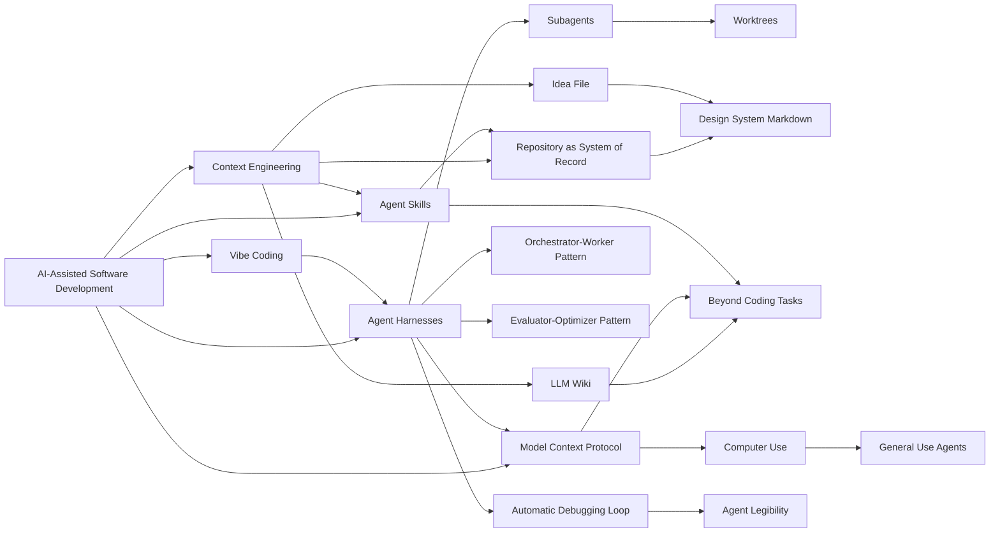

# Граф понятий - агентное программирование

## Кратко

Эта заметка делает центральный граф понятий AI-Assisted Software Development явным вместо того, чтобы оставлять идеи набором изолированных страниц.

## Текущий синтез

В текущем корпусе доминируют три кластера. Первый — это интеллект репозитория: AGENTS.md, DESIGN.md, repo references, machine-readable intent и on-demand procedural context через skills. Второй — архитектура исполнения: orchestrators, workers, subagents, worktrees, evaluator-loops и live external systems, подключенные через MCP. Третий — внешнее расширение: LLM wikis, idea files, computer use, general-use agents и design systems, которые переносят тот же harness-паттерн за пределы редактирования source code.

## Граф

## Поддерживающие источники

- [[russian/sources/2025-anthropic-effective-context-engineering#Summary]]
- [[russian/sources/2026-openai-harness-engineering#Summary]]
- [[russian/sources/2025-anthropic-claude-code-best-practices#Summary]]
- [[russian/sources/2026-karpathy-llm-knowledge-bases-snippet#Summary]]
- [[russian/sources/2026-karpathy-idea-file-llm-wiki-snippet#Summary]]

## Связанные страницы

- [[russian/index]]
- [[russian/theses]]
- [[russian/themes/Context Management and Agent Memory]]
- [[russian/themes/Agent Harnesses and Execution Loops]]
- [[russian/concepts/Model Context Protocol]]
- [[russian/concepts/Agent Skills]]
- [[russian/concepts/Model Context Protocol]]
- [[russian/concepts/Agent Skills]]
- [[russian/concepts/Model Context Protocol]]
- [[russian/concepts/Agent Skills]]
