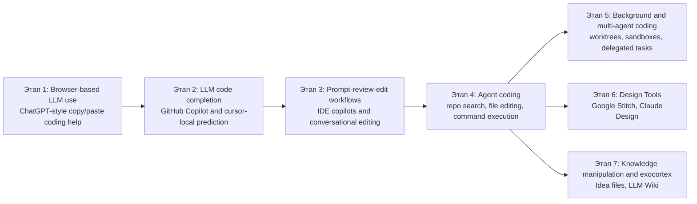

# История AI-Assisted Software Development

## Кратко

Эта заметка отображает главные фазовые сдвиги в AI-Assisted Software Development: от browser chat и inline completion до agent coding, multi-agent software work, design-side agents и knowledge-centric agent systems.

## Текущий синтез

Историю AI-Assisted Software Development лучше всего понимать как последовательность расширяющихся control loops. По продуктовой хронологии code completion появился раньше browser chat. По пользовательской хронологии именно browser chat стал для многих первым массовым входом в AI-assisted coding. Затем поле прошло через IDE-assisted editing, agentic tool use и, наконец, через background orchestration поверх worktrees, apps и knowledge systems.

## История AI-Assisted Software Development

Разбивка ниже начинается с browser use, потому что именно так многие люди впервые столкнулись с AI-assisted coding на практике, хотя [[russian/tools/GitHub Copilot|GitHub Copilot]] вышел раньше 29 июня 2021 года, а ChatGPT появился позже 30 ноября 2022 года.

## Таймлайн

## Заметки по этапам

- `Browser-based LLM use`: пользователи вставляли код в browser chat ради explanation, debugging, перевода и one-off generation. См. [[russian/sources/2022-openai-introducing-chatgpt#Сводка|Introducing ChatGPT]].
- `LLM code completion`: быстрые локальные suggestions сокращали число нажатий клавиш, но сохраняли контроль у человека. Классические anchors — [[russian/tools/GitHub Copilot|GitHub Copilot]] и inline-сторона [[russian/tools/GigaCode|GigaCode]]. См. [[russian/sources/2021-github-introducing-github-copilot#Сводка|Introducing GitHub Copilot]] и [[russian/sources/2026-gigacode-inline-code-assistant#Сводка|GigaCode Inline Code Assistant]].
- `Prompt-review-edit workflows`: сильные модели внутри IDE сместили усилие с набора синтаксиса на формулировку intent и review изменений. Примеры: [[russian/tools/Cursor|Cursor]], [[russian/tools/Gemini Code Assist|Gemini Code Assist]] и CodeChat-сторона [[russian/tools/GigaCode|GigaCode]]. См. [[russian/sources/2024-karpathy-cursor-sonnet-snippet#Сводка|Karpathy on Cursor + Sonnet]], [[russian/sources/2026-google-gemini-code-assist-overview#Сводка|Gemini Code Assist overview]] и [[russian/sources/2026-gigacode-codechat#Сводка|GigaCode CodeChat]].
- `Agent coding`: агенты получили repo search, file editing, command execution и self-verification. Здесь такие инструменты, как [[russian/tools/Claude Code|Claude Code]], [[russian/tools/OpenCode|OpenCode]], [[russian/tools/Qwen Code|Qwen Code]] и [[russian/tools/Gemini CLI|Gemini CLI]], перестают быть только suggesters и начинают оперировать полноценным software loop. См. [[russian/sources/2025-openai-introducing-codex#Сводка|Introducing Codex]], [[russian/sources/2025-anthropic-claude-code-best-practices#Сводка|Claude Code best practices]] и [[russian/sources/2025-google-gemini-cli#Сводка|Gemini CLI]].
- `Background and multi-agent coding`: worktrees, sandboxes, background environments и PR review surfaces сделали делегирование операционным. Репрезентативные инструменты: [[russian/tools/Codex|Codex]], [[russian/tools/Antigravity|Antigravity]], [[russian/tools/OpenHands|OpenHands]], [[russian/tools/Devin|Devin]] и [[russian/tools/GitHub Copilot Coding Agent|GitHub Copilot Coding Agent]]. См. [[russian/sources/2025-github-copilot-coding-agent-ga#Сводка|Copilot coding agent GA]], [[russian/sources/2026-openai-introducing-the-codex-app#Сводка|Introducing the Codex app]] и [[russian/sources/2026-bcherny-worktrees-snippet#Сводка|Boris Cherny on worktrees]].
- `Design tools`: [[russian/tools/Stitch|Stitch]] и [[russian/tools/Claude Design|Claude Design]] расширяют coding workflow, превращая visual intent в machine-usable artifacts. См. [[russian/sources/2026-google-stitch-vibe-design#Сводка|Stitch]] и [[russian/sources/2026-anthropic-claude-design#Сводка|Claude Design]].
- `Knowledge manipulation and exocortex`: [[russian/concepts/Idea File|idea files]], [[russian/concepts/LLM Wiki|LLM wikis]] и родственные knowledge structures переносят те же идеи harness-а за пределы source code. См. [[russian/sources/2025-karpathy-vibe-coding-snippet#Сводка|Karpathy on vibe coding]], [[russian/sources/2026-karpathy-idea-file-llm-wiki-snippet#Сводка|Karpathy on the idea file and LLM Wiki]] и [[russian/sources/2026-openai-codex-for-almost-everything#Сводка|Codex for (almost) everything]].

## Связанные страницы

- [[russian/index|Index]]
- [[russian/theses|Theses]]
- [[russian/themes/Agentic Coding and Vibe Coding|Agentic Coding and Vibe Coding]]
- [[russian/themes/Labor, Roles, and Team Structure|Labor, Roles, and Team Structure]]
- [[russian/analyses/Coding Tools by Style and Maturity - 2026|Coding Tools by Style and Maturity - 2026]]
