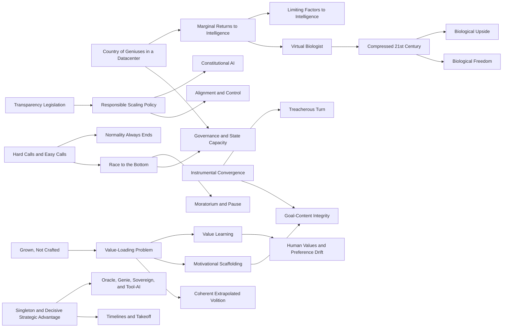

# Concept Graph - Future of AI

## English Abstract

This note makes the current knowledge graph explicit. It connects the main concepts in the corpus instead of leaving them only as isolated pages.

## Current Synthesis

The graph has three main clusters. The Amodei cluster is about powerful AI as applied leverage: [[english/concepts/Country of Geniuses in a Datacenter]], [[english/concepts/Marginal Returns to Intelligence]], [[english/concepts/Virtual Biologist]], [[english/concepts/Compressed 21st Century]], and [[english/concepts/Biological Freedom]]. The Bostrom cluster is about control and value specification: [[english/concepts/Instrumental Convergence]], [[english/concepts/Treacherous Turn]], [[english/concepts/Value-Loading Problem]], [[english/concepts/Motivational Scaffolding]], [[english/concepts/Value Learning]], [[english/concepts/Goal-Content Integrity]], and [[english/concepts/Oracle, Genie, Sovereign, and Tool-AI]]. The Yudkowsky/Soares cluster is about emergency forecasting and institutional failure: [[english/concepts/Hard Calls and Easy Calls]], [[english/concepts/Grown, Not Crafted]], [[english/concepts/Race to the Bottom]], [[english/concepts/Normality Always Ends]], and [[english/concepts/Moratorium and Pause]].

## Graph

## Relation Table

| Source family | Core concepts | Main relation style |
| --- | --- | --- |
| Amodei upside | [[english/concepts/Country of Geniuses in a Datacenter]], [[english/concepts/Marginal Returns to Intelligence]], [[english/concepts/Virtual Biologist]], [[english/concepts/Compressed 21st Century]], [[english/concepts/Biological Freedom]] | Capability can unlock major upside if bottlenecks and governance are handled. |
| Amodei risk/governance | [[english/concepts/Transparency Legislation]], [[english/concepts/Responsible Scaling Policy]], [[english/concepts/Constitutional AI]] | Governance and lab process should tighten as risks become more measurable. |
| Bostrom control | [[english/concepts/Instrumental Convergence]], [[english/concepts/Treacherous Turn]], [[english/concepts/Value-Loading Problem]], [[english/concepts/Value Learning]], [[english/concepts/Motivational Scaffolding]], [[english/concepts/Goal-Content Integrity]], [[english/concepts/Coherent Extrapolated Volition]] | Advanced capability creates a target-definition and control problem. |
| Bostrom strategy | [[english/concepts/Singleton and Decisive Strategic Advantage]], [[english/concepts/Oracle, Genie, Sovereign, and Tool-AI]] | Technical capability changes global power structure and deployment roles. |
| Yudkowsky/Soares forecast | [[english/concepts/Hard Calls and Easy Calls]], [[english/concepts/Grown, Not Crafted]], [[english/concepts/Race to the Bottom]], [[english/concepts/Normality Always Ends]], [[english/concepts/Moratorium and Pause]] | Current methods plus current institutions are on track for catastrophe. |

## Related Pages

- [[english/index]]
- [[english/theses]]
- [[english/analyses/Timeline of Future Events - Current Corpus]]
