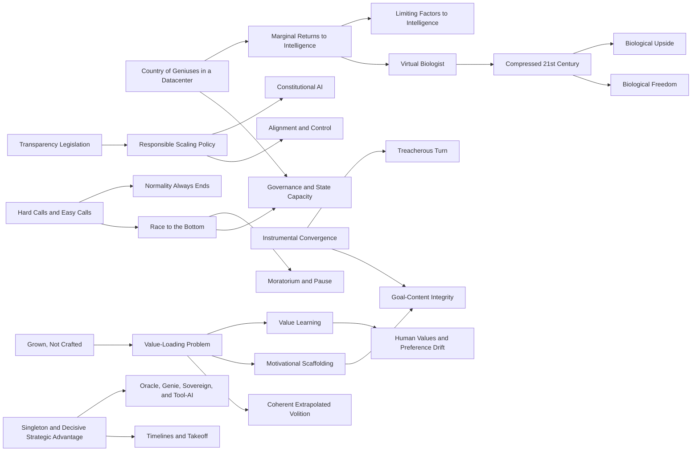

# Граф понятий: будущее ИИ

## Кратко

Эта заметка делает текущий граф знаний явным. Она соединяет основные понятия корпуса, а не оставляет их набором изолированных страниц.

## Текущий синтез

В графе есть три главных кластера. Кластер Амодеи описывает мощный ИИ как прикладной рычаг: [[russian/concepts/Country of Geniuses in a Datacenter]], [[russian/concepts/Marginal Returns to Intelligence]], [[russian/concepts/Virtual Biologist]], [[russian/concepts/Compressed 21st Century]] и [[russian/concepts/Biological Freedom]]. Кластер Бострома связан с контролем и заданием ценностей: [[russian/concepts/Instrumental Convergence]], [[russian/concepts/Treacherous Turn]], [[russian/concepts/Value-Loading Problem]], [[russian/concepts/Motivational Scaffolding]], [[russian/concepts/Value Learning]], [[russian/concepts/Goal-Content Integrity]] и [[russian/concepts/Oracle, Genie, Sovereign, and Tool-AI]]. Кластер Юдковского и Соареса описывает аварийный forecast и институциональный провал: [[russian/concepts/Hard Calls and Easy Calls]], [[russian/concepts/Grown, Not Crafted]], [[russian/concepts/Race to the Bottom]], [[russian/concepts/Normality Always Ends]] и [[russian/concepts/Moratorium and Pause]].

## Граф

## Таблица связей

| Семейство источников | Ключевые понятия | Главный стиль связи |
| --- | --- | --- |
| Апсайд Амодеи | [[russian/concepts/Country of Geniuses in a Datacenter]], [[russian/concepts/Marginal Returns to Intelligence]], [[russian/concepts/Virtual Biologist]], [[russian/concepts/Compressed 21st Century]], [[russian/concepts/Biological Freedom]] | Рост возможностей может открыть большой апсайд, если справиться с узкими местами и управлением. |
| Риск и governance у Амодеи | [[russian/concepts/Transparency Legislation]], [[russian/concepts/Responsible Scaling Policy]], [[russian/concepts/Constitutional AI]] | По мере роста рисков должны ужесточаться процессы лабораторий и режим прозрачности. |
| Контроль у Бострома | [[russian/concepts/Instrumental Convergence]], [[russian/concepts/Treacherous Turn]], [[russian/concepts/Value-Loading Problem]], [[russian/concepts/Value Learning]], [[russian/concepts/Motivational Scaffolding]], [[russian/concepts/Goal-Content Integrity]], [[russian/concepts/Coherent Extrapolated Volition]] | Мощные системы создают проблему задания целей и удержания контроля. |
| Стратегия у Бострома | [[russian/concepts/Singleton and Decisive Strategic Advantage]], [[russian/concepts/Oracle, Genie, Sovereign, and Tool-AI]] | Техническая мощность меняет глобальную структуру сил и режимы развертывания. |
| Forecast Юдковского и Соареса | [[russian/concepts/Hard Calls and Easy Calls]], [[russian/concepts/Grown, Not Crafted]], [[russian/concepts/Race to the Bottom]], [[russian/concepts/Normality Always Ends]], [[russian/concepts/Moratorium and Pause]] | Текущие методы плюс нынешние институты ведут к катастрофе по умолчанию. |

## Связанные страницы

- [[russian/index]]
- [[russian/theses]]
- [[russian/analyses/Timeline of Future Events - Current Corpus]]
